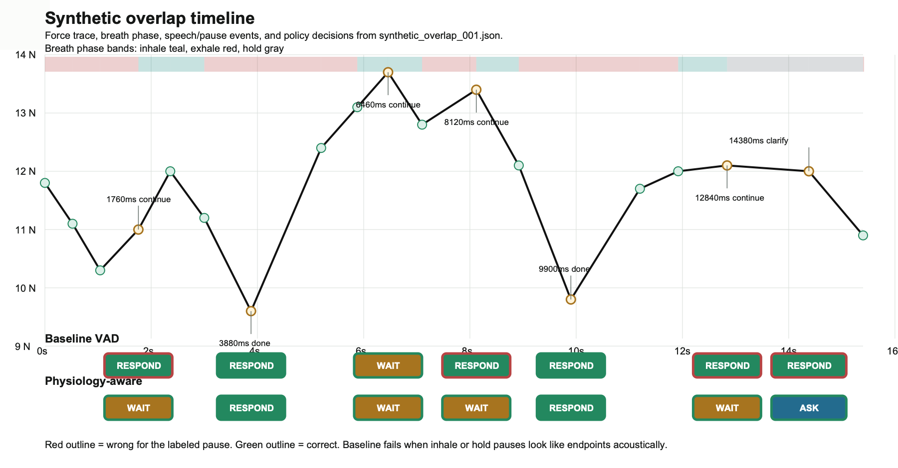
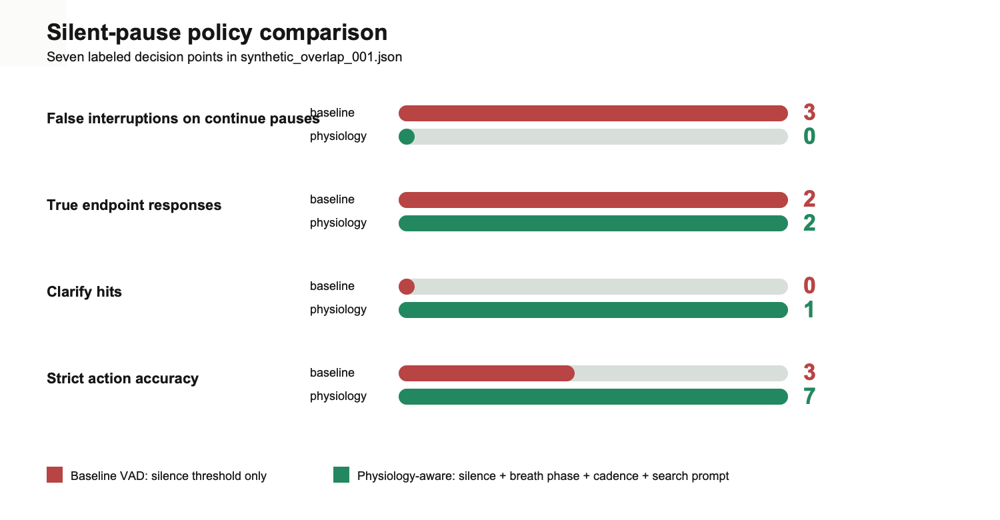

# Synthetic Overlap Analysis

Source fixture: [`examples/synthetic_overlap_001.json`](../examples/synthetic_overlap_001.json)

Analyzer:

```bash
python3 tools/analyze_overlapping_breath_speech.py
```

## Clear Conclusion

Silence duration is not enough. In this fixture, a fixed 650 ms VAD threshold mistakes inhale and breath-hold continuation pauses for endpoints. Breath phase plus cadence separates three cases that look similar acoustically:

- still thinking: inhale or high-WPM continuation, so wait
- actually done: exhale plus falling cadence, so respond
- stuck/searching: long hold plus uncertainty, so ask a tiny clarifying question

The strongest demo moment is `1760 ms`: the user has 720 ms of silence, but the force trace is rising/inhale and the user resumes at `2360 ms`. Baseline VAD interrupts. Physiology-aware turn-taking waits.

The research-interesting moment is `14380 ms`: 2460 ms of silence, breath hold, WPM 62, and ground truth `clarify`. The right behavior is not a full answer; it is a small prompt.

## Figure 1: Timeline



## Decision Points

| Time | Truth | Signal pattern | Baseline VAD | Physiology-aware | Conclusion |
| --- | --- | --- | --- | --- | --- |
| 1760 ms | continue | 720 ms silence + inhale | RESPOND | WAIT | baseline interrupts a thinking inhale |
| 3880 ms | done | 880 ms silence + exhale + falling WPM | RESPOND | RESPOND | both correctly respond |
| 6460 ms | continue | 580 ms silence + inhale + high WPM | WAIT | WAIT | both wait; physiology has stronger reason |
| 8120 ms | continue | 1020 ms silence + inhale + high WPM | RESPOND | WAIT | baseline interrupts a rambling continuation |
| 9900 ms | done | 980 ms silence + exhale + falling WPM | RESPOND | RESPOND | both correctly respond |
| 12840 ms | continue | 920 ms silence + breath hold/searching | RESPOND | WAIT | baseline interrupts word search |
| 14380 ms | clarify | 2460 ms silence + breath hold/searching | RESPOND | ASK CLARIFY | physiology gives the right small prompt |

## Figure 2: Metrics



## Quantitative Result

| Metric on silent decision points | Baseline VAD | Physiology-aware |
| --- | ---: | ---: |
| Silent decision points | 7 | 7 |
| False interruptions on continue pauses | 3 | 0 |
| Correct true endpoint responses | 2 / 2 | 2 / 2 |
| Clarify hits | 0 / 1 | 1 / 1 |
| Strict action accuracy | 3 / 7 | 7 / 7 |

## What This Proves

This branch turns the idea into a measurable benchmark: labeled overlapping speech/breath events, policy decisions, a reproducible analyzer, and graphable decision points.

It does not prove real-human generalization yet. The fixture is synthetic and shaped around the heuristic. The next milestone is one consented single-speaker recording aligned with Vernier force data, then rerunning this exact analyzer on the real trace.

Best positioning:

> We are not detecting emotion or health state. We are using physiological timing signals as an interaction-control signal to reduce bad interruptions in real-time voice AI.
